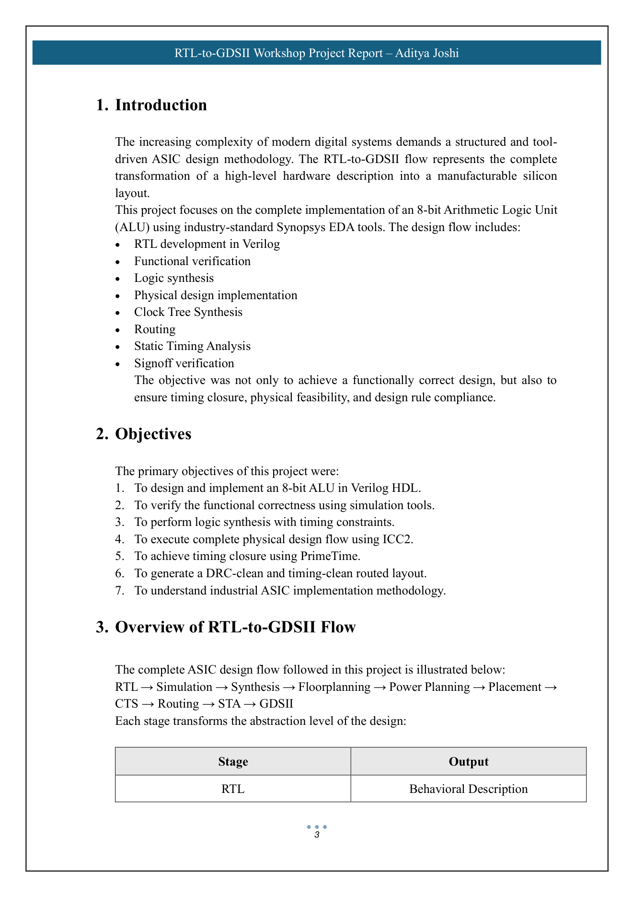
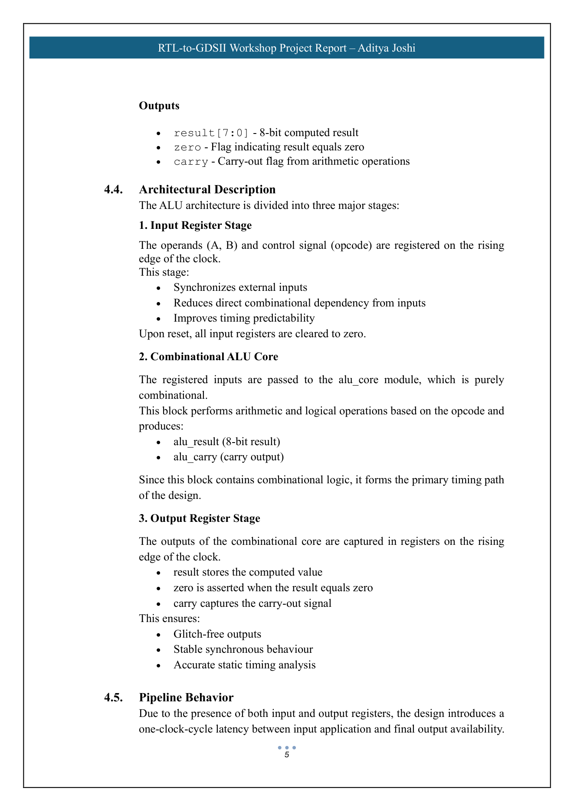
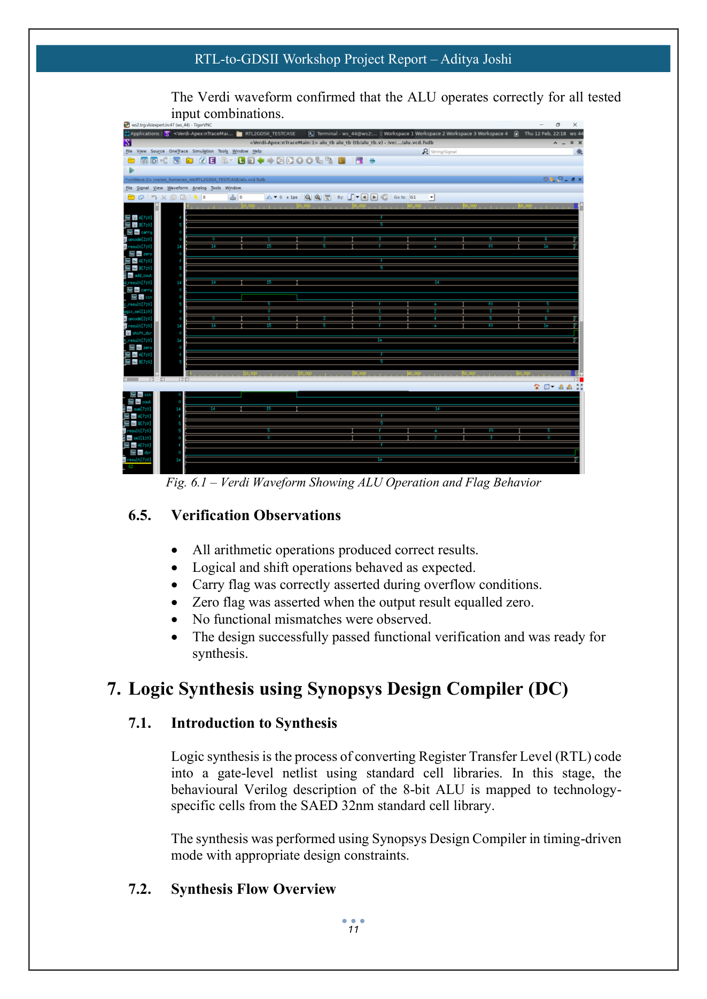
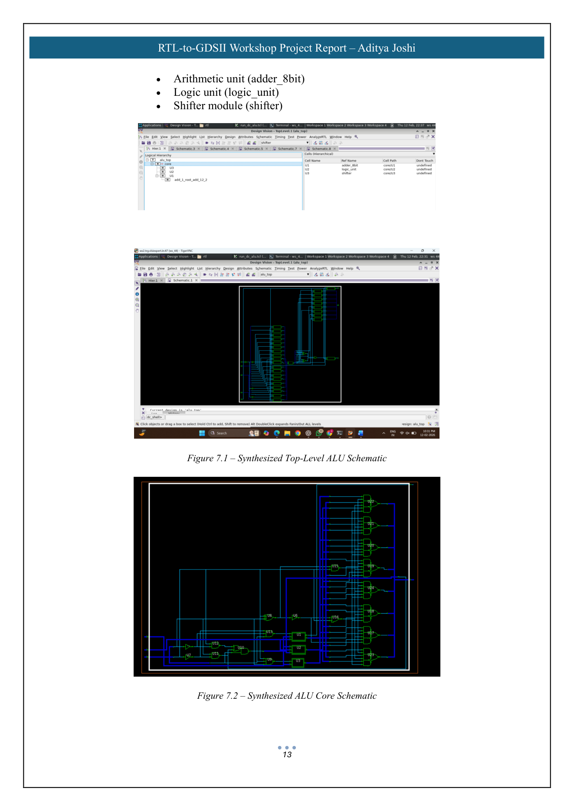
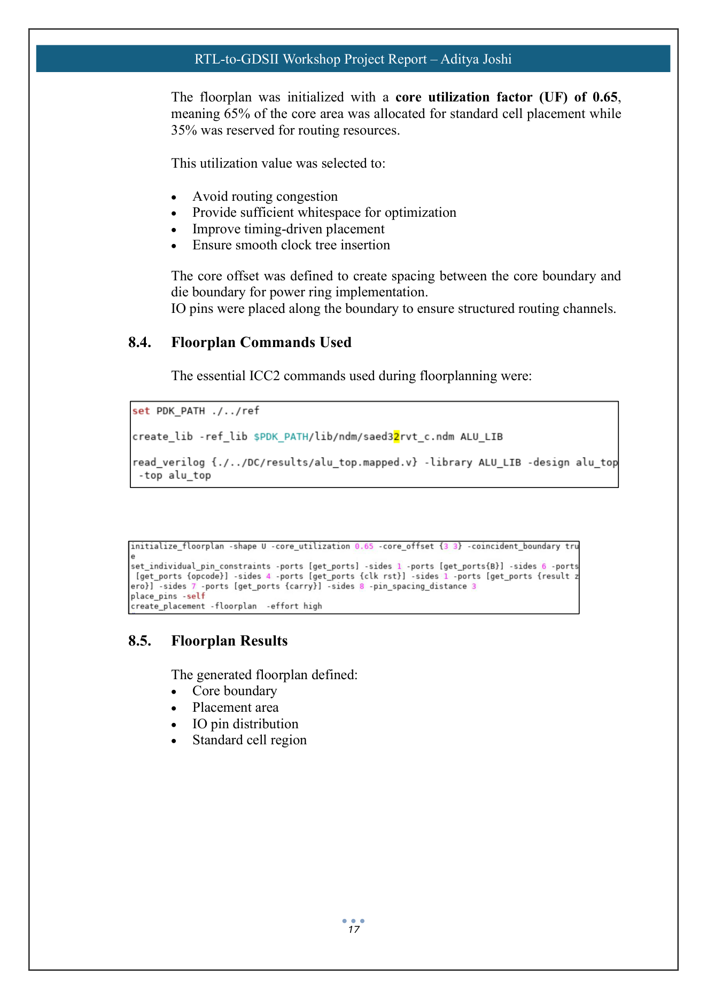
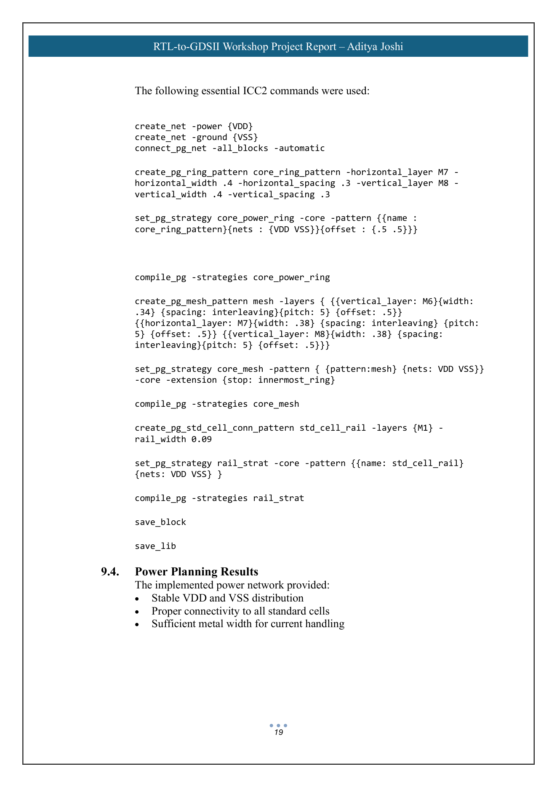
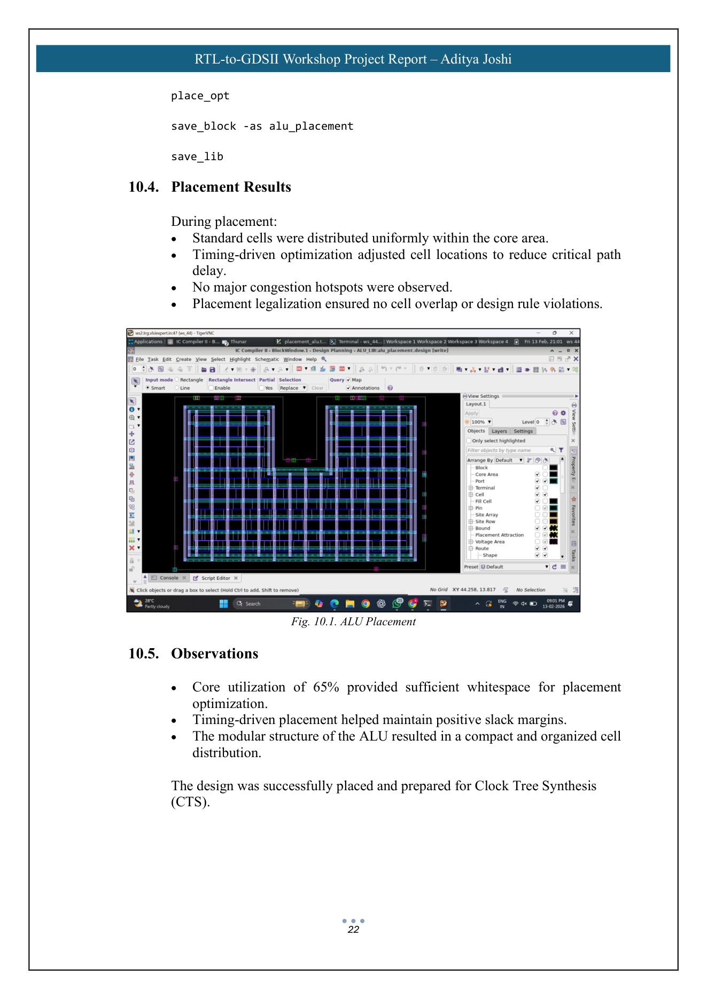
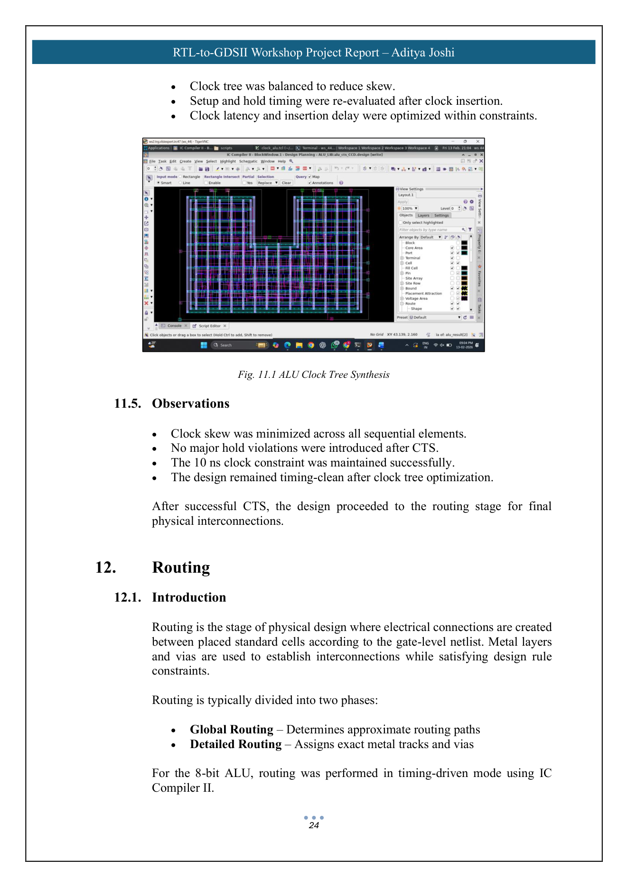
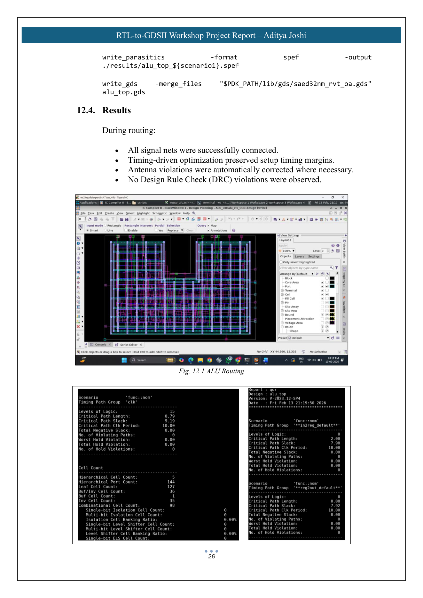
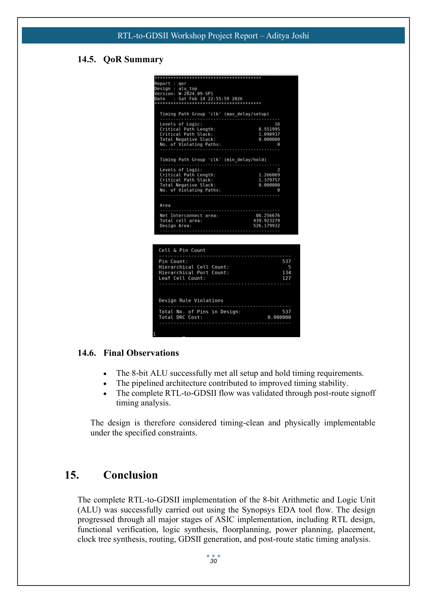

# 8-bit ALU — RTL-to-GDSII Implementation

## Overview

An 8-bit Arithmetic and Logic Unit (ALU) implemented and taken through a complete RTL-to-GDSII ASIC design flow using Synopsys EDA tools and the SAED 32nm technology library.

The project covers RTL design, functional verification, logic synthesis, timing constraint definition, floorplanning, power planning, placement, clock tree synthesis (CTS), routing, static timing analysis (STA), and GDSII generation.

## Design Specifications

| Parameter        | Specification                   |
| ---------------- | ------------------------------- |
| Design           | 8-bit Arithmetic and Logic Unit |
| HDL              | Verilog HDL                     |
| Technology       | SAED 32nm                       |
| Clock Period     | 10 ns                           |
| Target Frequency | 100 MHz                         |
| Architecture     | Synchronous pipelined           |
| Reset            | Asynchronous active-high        |
| Top Module       | `alu_top`                       |

## ALU Architecture

The ALU uses a three-stage architecture:

```text
       Inputs
     A, B, Opcode
          |
          v
  +----------------+
  | Input Registers|
  +----------------+
          |
          v
  +----------------+
  |   ALU Core     |
  |                |
  | +------------+ |
  | | 8-bit Adder| |
  | +------------+ |
  | | Logic Unit | |
  | +------------+ |
  | |   Shifter  | |
  | +------------+ |
  +----------------+
          |
          v
  +-----------------+
  | Output Registers|
  +-----------------+
          |
          v
   Result / Flags
```

The registered input and output stages introduce a one-clock-cycle latency while reducing the direct combinational path and improving timing predictability.

### Supported Operations

The 3-bit opcode selects one of eight operations:

| Opcode | Operation              |
| ------ | ---------------------- |
| `000`  | Addition               |
| `001`  | Addition with carry-in |
| `010`  | Bitwise AND            |
| `011`  | Bitwise OR             |
| `100`  | Bitwise XOR            |
| `101`  | Bitwise NOT            |
| `110`  | Logical left shift     |
| `111`  | Logical right shift    |

The ALU generates:

* 8-bit result
* Zero flag
* Carry flag

## RTL Design

The design is organized hierarchically into five Verilog modules:

| Module         | Function                                      |
| -------------- | --------------------------------------------- |
| `alu_top.v`    | Top-level wrapper with input/output registers |
| `alu_core.v`   | Opcode decoding and ALU operation selection   |
| `adder_8bit.v` | 8-bit arithmetic unit                         |
| `logic_unit.v` | Bitwise logical operations                    |
| `shifter.v`    | Left and right shift operations               |

The modular structure separates arithmetic, logical, and shift functionality while maintaining a synthesizable RTL architecture.

## Functional Verification

Functional verification was performed as part of the RTL-to-GDSII workshop using Synopsys VCS for simulation and Verdi for waveform analysis.

Verification covered:

* Clock generation
* Reset initialization
* Operand registration
* Opcode decoding
* Arithmetic operations
* Logical operations
* Shift operations
* Carry flag behavior
* Zero flag behavior
* One-cycle pipeline latency

A portfolio verification testbench is included at:

```text
testbench/ALU_tb.v
```

This testbench was reconstructed from the design specification documented in the project report and is provided for functional verification of the reconstructed RTL.

## RTL-to-GDSII Flow

```text
                         RTL
                          |
                          v
                Functional Verification
                    (VCS / Verdi)
                          |
                          v
                   Logic Synthesis
                 (Design Compiler)
                          |
                          v
                    SDC Constraints
                          |
                          v
                    Floorplanning
                        (ICC2)
                          |
                          v
                    Power Planning
                          |
                          v
                      Placement
                          |
                          v
               Clock Tree Synthesis
                         (CTS)
                          |
                          v
                       Routing
                          |
                          v
             Static Timing Analysis
                     (PrimeTime)
                          |
                          v
                        GDSII
```

## Synthesis

Logic synthesis was performed using Synopsys Design Compiler.

The RTL was mapped to technology-specific standard cells using the SAED 32nm standard cell library.

The synthesis flow included:

* Library setup and linking
* RTL analysis and elaboration
* SDC constraint definition
* Timing-driven optimization
* Quality-of-results analysis
* Gate-level netlist generation

The design was synthesized with a 10 ns clock constraint corresponding to a target frequency of 100 MHz.

## Physical Design

Physical implementation was performed using Synopsys IC Compiler II (ICC2).

### Floorplanning

The design was initialized with a core utilization factor of 65%.

The floorplan included:

* Core boundary
* Placement region
* I/O pin distribution
* Standard-cell region

### Power Planning

A power distribution network was implemented using:

* Core power ring
* Higher-metal power mesh
* Standard-cell power rails

### Placement

Timing-driven placement was performed while maintaining the 10 ns clock constraint.

### Clock Tree Synthesis

Clock Tree Synthesis (CTS) was performed to:

* Balance clock distribution
* Reduce clock skew
* Control insertion delay
* Maintain setup and hold timing

### Routing

Timing-driven routing was performed to complete signal interconnections while satisfying timing and physical design constraints.

Antenna handling and routing optimization were also applied during the reported physical-design flow.

## Static Timing Analysis

Post-route static timing analysis was performed using Synopsys PrimeTime.

The analysis used:

| Parameter    | Value   |
| ------------ | ------- |
| Clock Period | 10 ns   |
| Frequency    | 100 MHz |

The reported analysis verified:

* Setup timing
* Hold timing
* Critical paths
* Clock behavior
* Timing closure

The critical timing path was reported within the ALU arithmetic logic.

## GDSII Generation

After routing and physical verification, the final layout was exported in GDSII format using IC Compiler II.

The reported flow verified:

* Fully routed signal nets
* Power and ground connectivity
* Clock tree implementation
* Timing closure
* DRC cleanliness

## Reported Implementation Results

| Parameter        | Result    |
| ---------------- | --------- |
| Technology       | SAED 32nm |
| Clock Period     | 10 ns     |
| Frequency        | 100 MHz   |
| Core Utilization | 65%       |
| Hold Violations  | None      |
| DRC Violations   | 0         |
| Setup Timing     | Met       |

The reported results indicate that the design achieved timing closure and a DRC-clean physical implementation.

## Project Visuals

### RTL-to-GDSII Flow



### ALU Architecture



### Functional Verification



### Synthesis



### Floorplanning



### Power Planning



### Placement



### Clock Tree Synthesis



### Routing



### Post-Route Timing



## Tools and Technologies

* Verilog HDL
* Synopsys VCS
* Synopsys Verdi
* Synopsys Design Compiler
* Synopsys IC Compiler II
* Synopsys PrimeTime
* SAED 32nm
* Static Timing Analysis
* RTL Simulation
* Logic Synthesis
* Physical Design
* GDSII

## Repository Structure

```text
8-bit ALU RTL-to-GDSII/
│
├── rtl/
│   ├── alu_top.v
│   ├── alu_core.v
│   ├── adder_8bit.v
│   ├── logic_unit.v
│   └── shifter.v
│
├── testbench/
│   └── ALU_tb.v
│
├── constraints/
│   └── alu_top.sdc
│
├── images/
│   ├── 01_rtl_to_gdsii_flow.png
│   ├── 02_alu_architecture.png
│   ├── 03_verdi_waveform.png
│   ├── 04_synthesis_schematic.png
│   ├── 05_floorplan.png
│   ├── 06_power_plan.png
│   ├── 07_placement.png
│   ├── 08_cts.png
│   ├── 09_routing.png
│   └── 10_final_timing.png
│
└── README.md
```

## Project Highlights

* Designed an 8-bit synchronous pipelined ALU in Verilog
* Implemented modular arithmetic, logical, and shift units
* Performed functional verification using VCS and Verdi
* Applied timing constraints for 100 MHz operation
* Performed logic synthesis using Design Compiler
* Executed physical design using IC Compiler II
* Worked through floorplanning, power planning, placement, CTS, and routing
* Performed post-route static timing analysis using PrimeTime
* Generated the final GDSII layout
* Achieved reported timing closure and zero DRC violations
